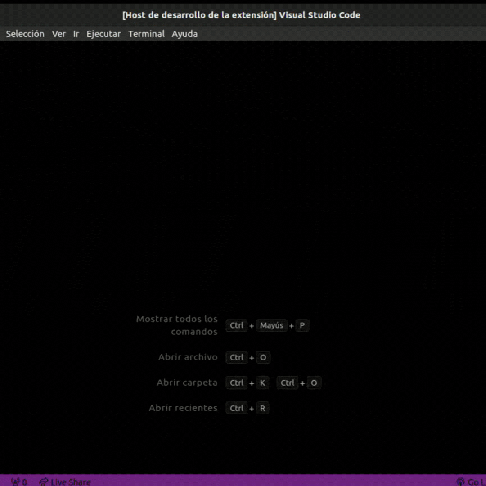
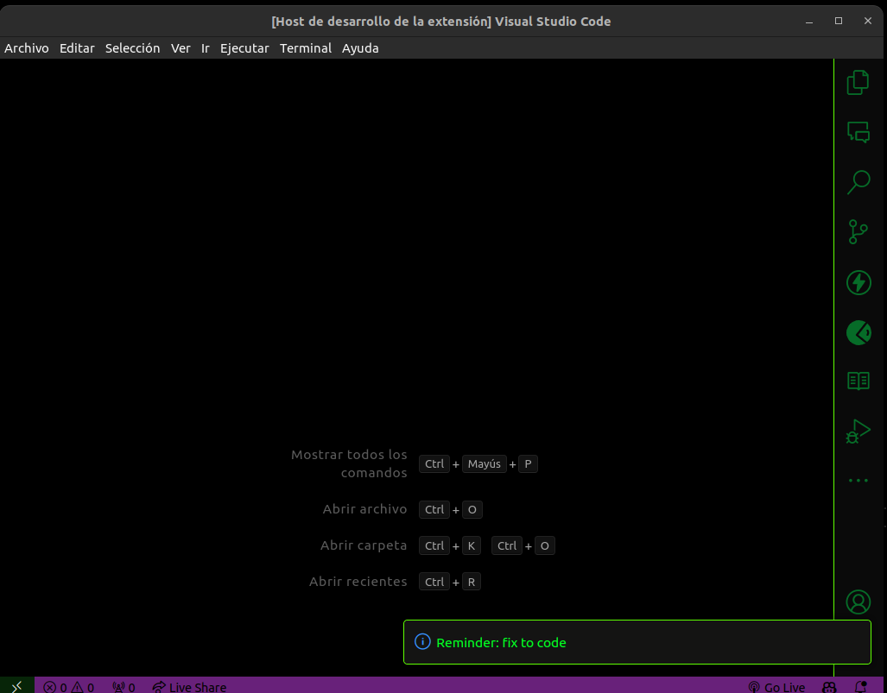

# Reminder work for VS Code

This extension allows Visual Studio Code users to set reminders within the editor, displaying notifications at specified times. It's perfect for reminding yourself to take breaks, check certain parts of the code, or any other scheduled task.

## Features

- **Set Reminders**: Easily set up reminders with custom messages.
- **Integrated Notifications**: Receive notifications directly in VS Code without disrupting your workflow.

## Usage

1. **Open Command Palette**: Use `Ctrl+Shift+P` (or `Cmd+Shift+P` on Mac) to open the command palette.
2. **Search and Execute**: Type "Set Reminder" and press Enter.
3. **Configure Reminder**: Follow the on-screen instructions to set your reminder.

## Installation

You can install the extension directly from the [Visual Studio Code Marketplace](<link to your extension>).

## Contributing

If you find a bug or have an idea for improving the extension, please open an issue or submit a pull request on [GitHub](<link to your repository>).

## License

This extension is under the MIT license. See the [LICENSE](LICENSE) file for more details.

## Acknowledgements

- Thanks to everyone who contributed ideas, feedback, and code.
# reminder-work
